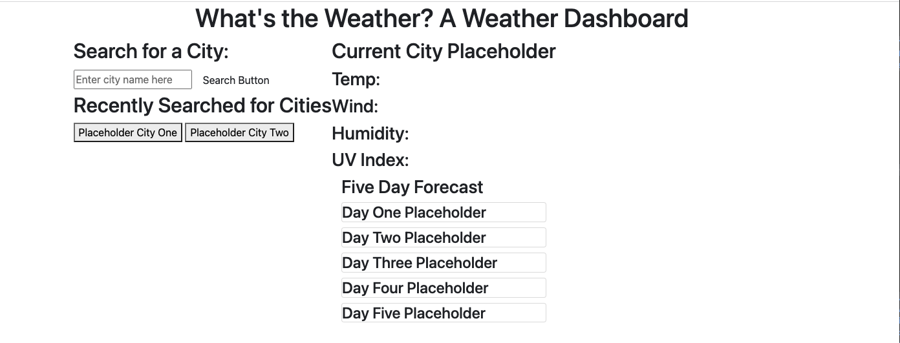

# Challenge Six: Weather Dashboard

## For this challenge, I started to create a weather dashboard. I ran out of time and this project is incomplete. As of now, the layout is set up with some minor styling. The page is fetching information from the Open Weather api, but that information doesn't yet display on the page. There are many improvements that I need to make on this application in the future for it to be functional. 

### This link will take you to the deployed application:

[See deployed site here](https://kristynerhaugen.github.io/what-is-the-weather/)

## Installation
### Access the code via GitHub. Install how you would usually install from a GitHub repository. 

## Usage
### Once fully functional, this application is to be used to see the current weather and five day forecast for any searched for city. 

### This image shows the deployed site:
#### 

## Credits 
### I used what I learned in the BootCamp Spot modules and BootCamp classes to create this quiz. I especially used what I learned in Module 6. To implement Bootstrap for the layout, I referred to https://getbootstrap.com/docs/4.3/getting-started/introduction/. I also referred to mdn (https://developer.mozilla.org/en-US/) and w3schools (https://www.w3schools.com/) frequently while working on this application. I used the Open Weather API found at https://openweathermap.org/api in the application. 

## License